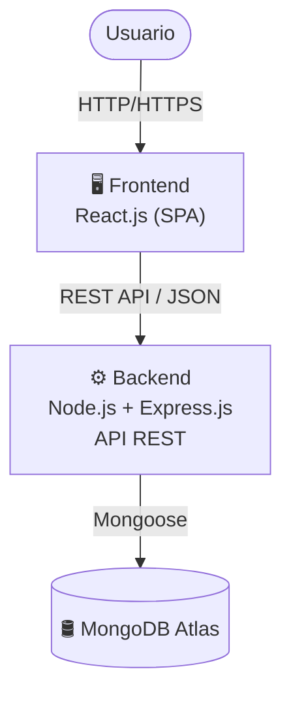

# Sistema de Generación Óptima de Horarios Académicos
Plataforma web desarrollada para optimizar la planificación académica mediante la generación automática de horarios, considerando restricciones y criterios de asignación de cursos y docentes.

---

## Tabla de Contenido

1. [Integrantes del equipo](#integrantes-del-equipo)
2. [Problemática abordada](#problemática-abordada)
3. [Justificación del PMV](#justificación-del-pmv)
4. [Tecnologías utilizadas](#tecnologías-utilizadas)
5. [Arquitectura del sistema](#arquitectura-del-sistema)
6. [Instrucciones de instalación](#instrucciones-de-instalación)
7. [Instrucciones de build](#instrucciones-de-build)

---

## Integrantes del equipo

| Nombre completo | Rol en el equipo |
|---|---|
| Contreras Infanzón Alexandra Mirella | Developer – Backend |
| Espinoza Zarate Juan Carlos | Scrum Master |
| Huaman Raymundo Yenifer Nicole | Product Owner |
| Olivera Paredes Talita Keren | Developer – Frontend |
| Vega Carhuallanqui Tatiana | Testing y QA |

---

## Problemática abordada

Las universidades con currículo flexible enfrentan dificultades en la generación de horarios académicos debido a múltiples factores como:

- Alta variabilidad en la matrícula estudiantil
- Disponibilidad limitada de docentes y aulas
- Restricciones académicas (prerrequisitos, créditos)
- Conflictos de horarios entre cursos
- Necesidad de optimización multiobjetivo

Este problema es considerado un problema complejo de ingeniería (NP-hard), ya que involucra múltiples variables interdependientes y no posee una solución única o trivial.

---

## Justificación del PMV

El desarrollo de un Producto Mínimo Viable (PMV) permite:

- Validar una solución inicial al problema de generación de horarios
- Reducir la complejidad mediante un enfoque incremental
- Evaluar la viabilidad técnica del sistema
- Obtener retroalimentación temprana de usuarios
- Implementar funcionalidades clave como:
  - Registro de entidades (estudiantes, docentes, cursos, aulas)
  - Validación de restricciones duras y blandas
  - Generación automática de horarios con función objetivo medible

---

## Tecnologías utilizadas

| Capa | Tecnología | Versión |
|------|------------|---------|
| Frontend | React.js | 18+ |
| Backend | Node.js + Express.js | 18+ / 4+ |
| Base de datos | MongoDB | Atlas |
| Control de versiones | Git y GitHub | — |
| Metodología | Scrum | — |
| Testing | Jest | 29+ tests · cobertura 100% |

---

## Arquitectura del sistema

El sistema implementa una arquitectura por capas basada en el stack **MERN**, utilizando una **SPA (Single Page Application)** en el frontend y una **API REST** para la comunicación entre componentes.

### Capas del sistema

- **Frontend (React.js):** Implementado como SPA, permite la interacción del usuario con el sistema, incluyendo la gestión de cursos, docentes y la visualización de horarios generados.
- **Backend (Node.js + Express.js):** Expone una API REST y gestiona la lógica de negocio, incluyendo el algoritmo de optimización para la generación de horarios académicos.
- **Base de datos (MongoDB):** Responsable de la persistencia de datos relacionados con cursos, docentes, horarios y restricciones académicas.

### Principios aplicados

- **Separación de responsabilidades:** Cada capa cumple una función específica dentro de la arquitectura.
- **Escalabilidad:** Permite incorporar nuevos módulos sin afectar la estructura general.
- **Mantenibilidad:** Facilita la evolución, corrección y mejora continua del sistema.
- **Modularidad:** Favorece el desarrollo independiente de componentes y la reutilización de código.

---

## Instrucciones de instalación

### Prerequisitos

| Requisito | Versión mínima |
|-----------|---------------|
| Node.js | v18 o superior |
| MongoDB | Atlas o instancia local |
| Git | cualquier versión reciente |

### 1. Clonar el repositorio

```bash
git clone https://github.com/talitakeren/Repositorio_proyecto.git
cd Repositorio_proyecto
```

### 2. Instalar dependencias del backend

```bash
cd backend
npm install
```

### 3. Instalar dependencias del frontend

```bash
cd ../frontend
npm install
```

---

## Instrucciones de build

### Backend

```bash
cd backend
npm install
```

### Frontend

```bash
cd frontend
npm run build
```

> Los archivos de producción se generan en `frontend/dist/`.

### a. Instrucciones de despliegue

**Backend:**
```bash
cd backend
node --env-file=config.env server
```

**Frontend:**
```bash
cd frontend
npm run dev
```

El sistema estará disponible en:

| Servicio | URL |
|----------|-----|
| API Backend | http://localhost:5050 |
| Frontend React | http://localhost:5173 |

### b. Enlace a video explicativo
🔗 Ver video del proyecto (máx. 5 minutos)

### c. Enlaces a la documentación

La documentación del proyecto se encuentra organizada en la carpeta [`/docs`](./docs/) siguiendo el ciclo de vida del proyecto basado en las áreas de gestión propuestas por PMBOK.

| Área | Carpeta | Contenido principal |
|--------|---------|---------|
| Inicio | [`docs/1.inicio/`](https://github.com/talitakeren/Repositorio_proyecto/tree/main/docs/1.inicio) | Definición del problema, visión del proyecto, acta de constitución (Project Charter), identificación del equipo, enfoque de desarrollo, supuestos, restricciones y requerimientos iniciales. |
| Planificación | [`docs/2.planificacion/`](https://github.com/talitakeren/Repositorio_proyecto/tree/main/docs/2.planificacion) | Backlog del producto y sprint, cronograma de hitos, presupuesto y gestión de riesgos del proyecto. |
| Ejecución | [`docs/3.ejecucion/`](https://github.com/talitakeren/Repositorio_proyecto/tree/main/docs/3.ejecucion) | Documentación técnica del sistema, especificación funcional, casos verificables, evidencias de ejecución, sostenibilidad (Green Software) y evolución de requerimientos. |
| Seguimiento y Control | [`docs/4.seguimiento_control/`](https://github.com/talitakeren/Repositorio_proyecto/tree/main/docs/4.seguimiento_control) | Métricas ágiles, validación de requisitos no funcionales, análisis del problema, resultados de pruebas y evidencias de validación. |
| Cierre | [`docs/5.cierre/`](https://github.com/talitakeren/Repositorio_proyecto/tree/main/docs/5.cierre) | Documentos de cierre del proyecto, lecciones aprendidas, evaluación de resultados, cumplimiento de objetivos y entregables finales. |
| Otros | [`docs/6.otros/`](https://github.com/talitakeren/Repositorio_proyecto/tree/main/docs/6.otros) | Documentación complementaria del proyecto: AGENTS.md y SPEC.md, utilizados como artefactos de apoyo para la definición técnica y organización del desarrollo. |
