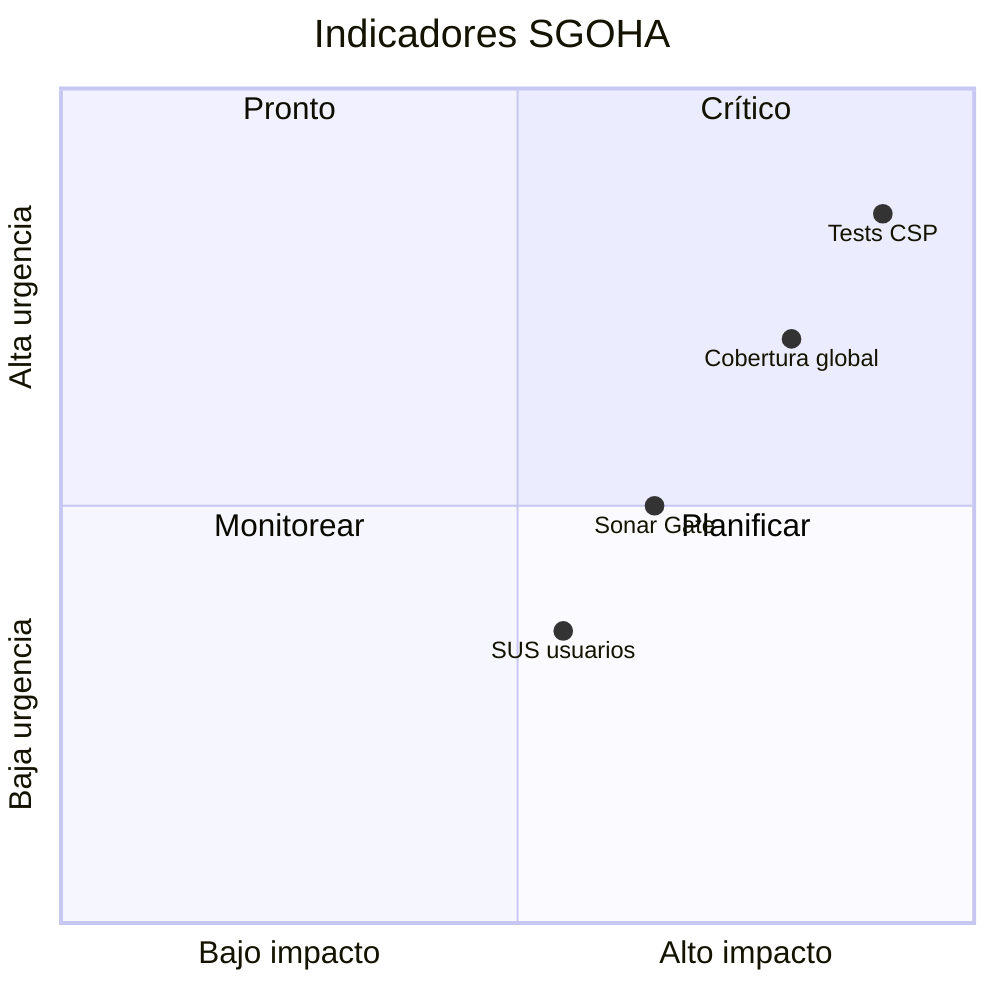

# Análisis e interpretación de métricas — SGOHA

> **Última ejecución:** 2026-06-17 · `npm run test:coverage` · Commit `fb539a2`

## Métricas de calidad

| Concepto | Valor SGOHA | Interpretación |
| -------- | ----------- | -------------- |
| **Bugs (Sonar)** | 4 | Defectos confirmables por analizador; priorizar corrección por severidad |
| **Code smells** | 777 | Deuda de mantenibilidad acumulada en módulos amplios |
| **Duplicación** | 1,4 % | Duplicación controlada, no es el principal riesgo actual |
| **Complejidad cognitiva** | 1555 | `csp.service.js` y páginas de matrícula siguen siendo puntos calientes |
| **Deuda técnica** | 3794 (`sqale_index`) | Requiere plan de remediación incremental por sprint |
| **Mantenibilidad** | ESLint 0 errores | 🟢 Frontend compilable sin deuda sintáctica bloqueante |

## Métricas de confiabilidad

| Métrica | Resultado | Interpretación SGOHA |
| ------- | --------- | -------------------- |
| Pruebas ejecutadas | **208** | Suite raíz: unit + integración API + MSW |
| Pruebas aprobadas | **208** | 🟢 Regresión estable |
| Pruebas fallidas | **0** | — |
| Cobertura líneas | **30,3 %** | 🟡 Insuficiente para módulos críticos de matrícula |
| Ramas no cubiertas | **85,9 %** | Validaciones condicionales de enrollment poco ejercitadas |
| Funciones críticas sin cubrir | `scheduleService`, `restrictionService`, CSP completo | 🟠 Riesgo en generación de horarios |

**Ejemplo:** Baja cobertura del servicio de matrícula implica que errores en prerrequisitos o créditos podrían permitir matrículas inválidas que afecten al motor CSP.

## Métricas de seguridad

| Métrica | Resultado | Interpretación |
| ------- | --------- | -------------- |
| npm audit backend | **0** vulnerabilidades | Tras fix `qs@6.15.2` |
| npm audit frontend | **5** (2 alta dev) | Monitorear `vite`, `form-data`; ver [NPM_AUDIT_INTERPRETATION.md](./reportes/security/NPM_AUDIT_INTERPRETATION.md) |
| CodeQL | ⚙️ En GitHub Actions | Revisar pestaña Security |
| OWASP controles | Helmet, RBAC, rate limit | 🟢 [OWASP_ANALYSIS.md](./reportes/security/OWASP_ANALYSIS.md) |
| Secretos en repo | Scan CI sin hallazgos obvios | 🟢 |

## Métricas de accesibilidad

| Métrica | Estado | Notas |
| ------- | ------ | ----- |
| Violaciones axe críticas | Umbral 0 en specs | `npm run test:a11y` |
| Lighthouse | Config listo | Ejecutar `npx @lhci/cli autorun` |
| Contraste / teclado | Checklist manual | 🧑‍💻 [WCAG_MANUAL_CHECKLIST.md](./reportes/accessibility/WCAG_MANUAL_CHECKLIST.md) |

## Métricas de usabilidad

| Métrica | Estado |
| ------- | ------ |
| SUS piloto metodológico | ✅ [SUS_PILOT_METHODOLOGY.md](./reportes/usability/SUS_PILOT_METHODOLOGY.md) |
| SUS real | 🧑‍💻 Requiere participantes |
| Observaciones por rol | Documentadas cualitativamente en [SUS_ANALYSIS.md](./reportes/usability/SUS_ANALYSIS.md) |

## Métricas CI/CD

| Métrica | Estado |
| ------- | ------ |
| Jobs CI | lint, build, test, coverage, audit, a11y |
| Sonar | ✅ Ejecutado local + condicional en CI (`SONAR_TOKEN`) |
| ZAP | Stack local o URL externa |
| CD | Plantilla — no desplegado |

## Matriz de indicadores

| Métrica | Definición | Cómo se obtiene | Umbral recomendado | Resultado | Interpretación SGOHA | Acción |
| ------- | ---------- | --------------- | ------------------ | --------- | -------------------- | ------ |
| Cobertura líneas | % líneas ejecutadas en tests | `npm run test:coverage` | ≥ 70 % global | 30,3 % | Huecos en CSP y portales | Ampliar tests API horarios |
| Tests pasando | Regresiones detectadas | `npm test` | 100 % | 208/208 | CI confiable | Mantener |
| ESLint errores | Calidad sintáctica React | `cd frontend && npm run lint` | 0 | 0 | Mantenibilidad UI | Mantener |
| npm audit high+ | CVEs explotables | `npm run audit:security` | 0 en prod | 0 backend; 2 high frontend dev | Riesgo runtime limitado | `npm audit fix` frontend |
| axe críticas | Barreras graves a11y | `npm run test:a11y` | 0 | Caso definido | Login/dashboard cubiertos | Ampliar specs |
| Quality Gate Sonar | Política de release | SonarScanner | Passed | Requiere ejecución | No evaluado en panel | Configurar token |
| SUS promedio | Usabilidad percibida | CSV + script | ≥ 68 | Sin datos reales | Instrumento listo | Aplicar protocolo |

## Priorización



## Reportes HTML

```bash
npm run test:coverage && npm run coverage:open
```

- [`tests/reports/coverage/index.html`](../tests/reports/coverage/index.html)
- [`tests/reports/coverage/html/index.html`](../tests/reports/coverage/html/index.html)
