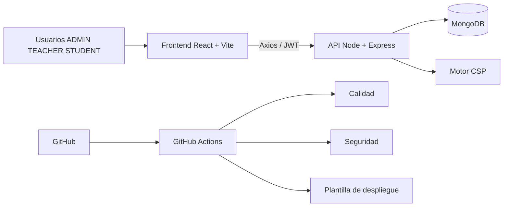
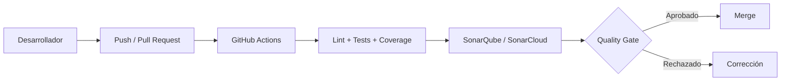
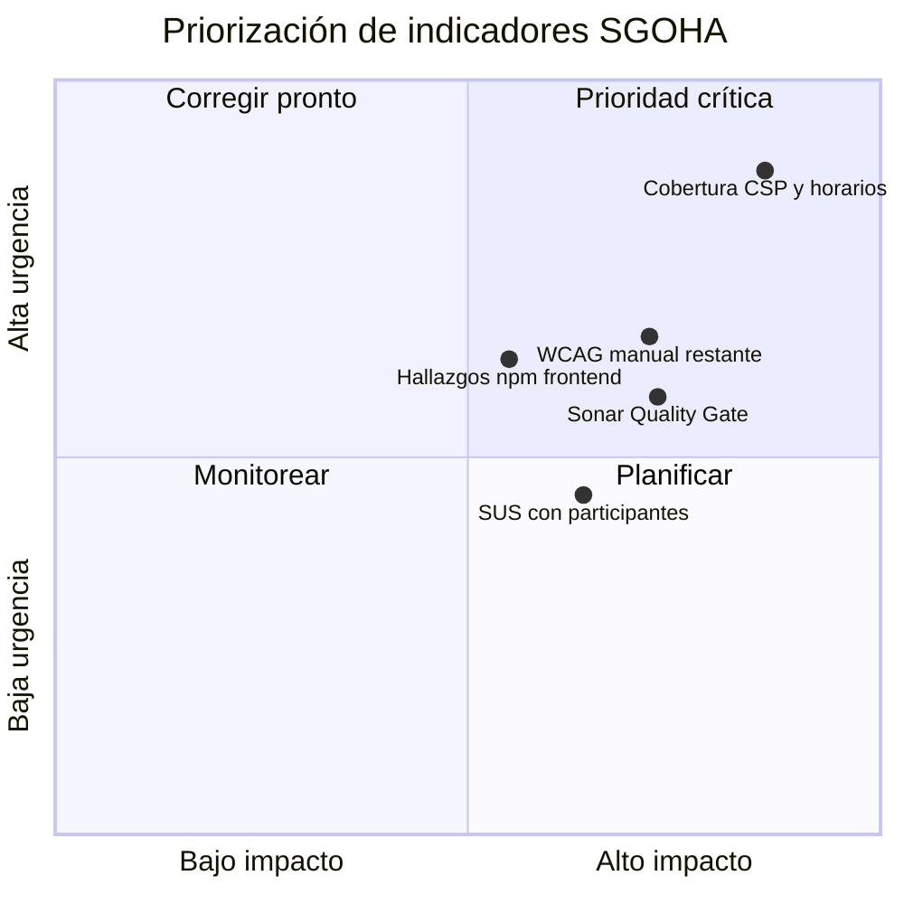
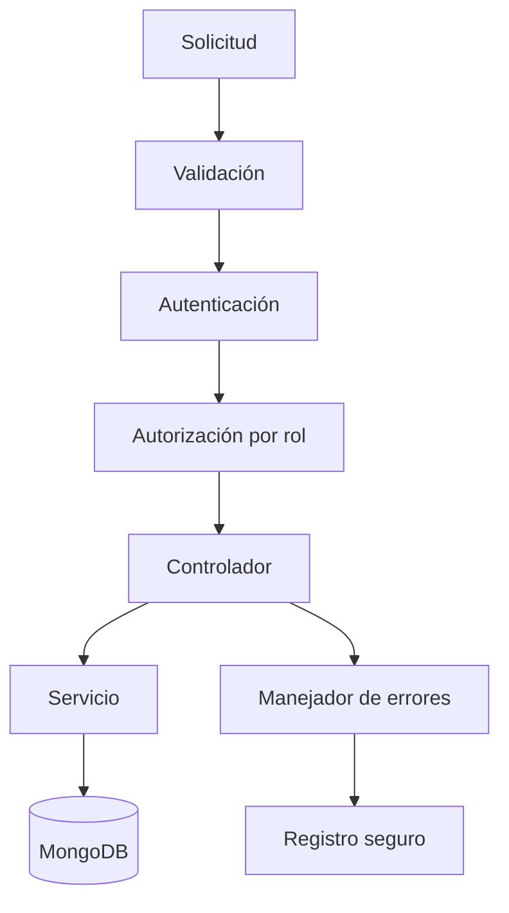
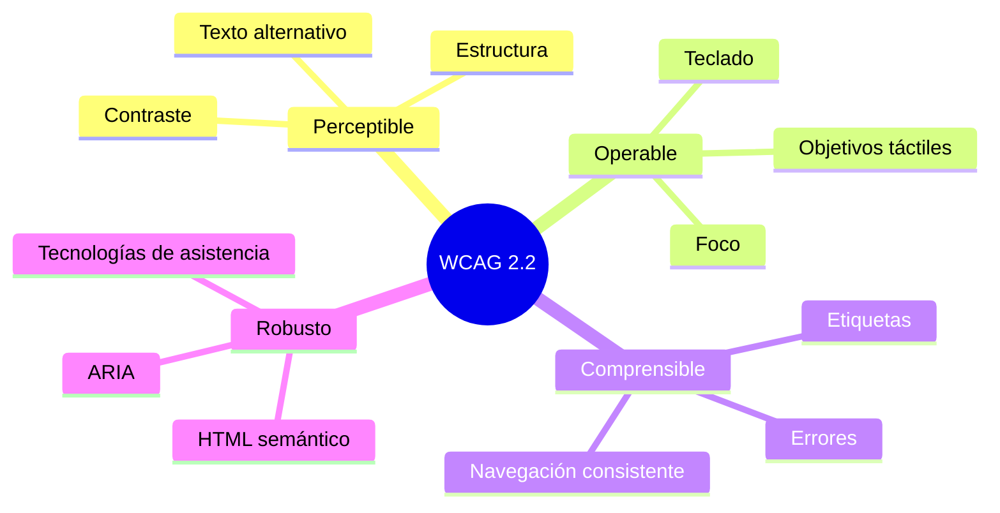
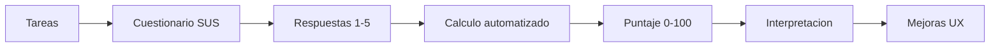
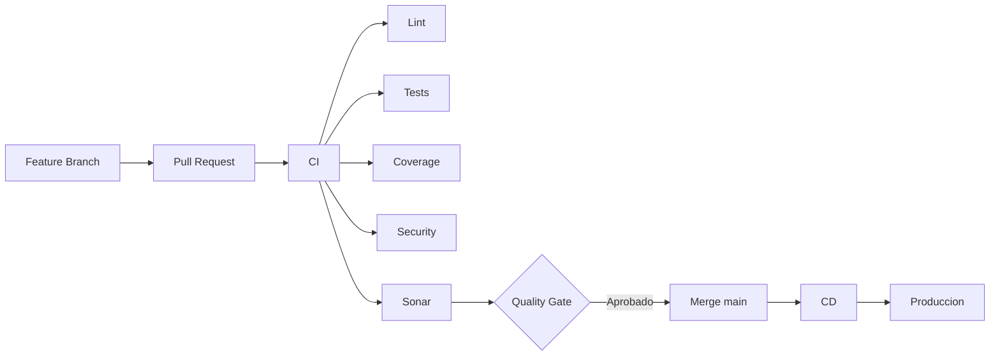

# 🛡️ Informe técnico integral del sistema SGOHA

**Punto 7.2 del informe técnico:**  
Análisis SonarQube · Interpretación de métricas · Análisis OWASP · Validación WCAG 2.2 · Análisis SUS

---

## Datos de identificación

| Campo | Valor |
| ----- | ----- |
| **Proyecto** | SGOHA — Sistema de Generación Óptima de Horarios Académicos |
| **Versión analizada** | 2.0.0 |
| **Rama** | `main` |
| **Commit de referencia** | `fb539a2` |
| **Fecha de corte** | 2026-06-17 |
| **Equipo responsable** | QA/Arquitectura/DevSecOps SGOHA |
| **Stack validado** | React 19 + Vite 8 + Tailwind 4 · Node/Express 5 · MongoDB/Mongoose 8 · JWT · Jest · Cypress |
| **Entorno de evaluación** | macOS local + workflows GitHub Actions |
| **Estado SonarQube al cierre** | ✅ Ejecutado localmente + Quality Gate disponible (explicado en 7.2.a) |

---

## Resumen ejecutivo

### Propósito del análisis

Consolidar un expediente técnico **reproducible y verificable** del nivel de calidad, seguridad, accesibilidad y usabilidad del sistema SGOHA, sin inventar métricas ni resultados.

### Herramientas utilizadas

- ⚙️ **Calidad:** ESLint, Jest, cobertura LCOV.
- ⚙️ **Seguridad:** npm audit, revisión OWASP Top 10, CodeQL, ZAP baseline.
- ⚙️ **Accesibilidad:** Cypress + axe-core, Lighthouse CI (configurado), checklist manual WCAG.
- ⚙️ **Usabilidad:** cuestionario SUS, protocolo, script de cálculo automático.

### Hallazgos clave

- 🟡 Cobertura global de pruebas en **30,3 %** de líneas (riesgo medio en módulos CSP/horarios).
- ✅ Backend sin vulnerabilidades auditables tras actualización de `qs` (`6.15.2`).
- ✅ Frontend con ESLint sin errores bloqueantes (advertencias documentadas).
- ⚙️ Flujo CI/CD operativo para lint, tests, cobertura, seguridad y accesibilidad.
- ✅ SonarQube ejecutado localmente con análisis real (`projectKey: sgoha`) y Quality Gate consultable.

### Mejoras implementadas en esta iteración

- ✅ Refuerzo documental integral del punto 7.2 por apartados conceptuales y técnicos.
- ✅ Ejecución real de SonarQube local y publicación de métricas verificables.
- ✅ Cierre de trazabilidad entre informe principal y evidencias/guías de reproducción.

---

## Arquitectura evaluada

### Componentes funcionales verificados

- Autenticación JWT y control de acceso por rol (`ADMIN`, `TEACHER`, `STUDENT`).
- Gestión académica: usuarios, cursos, docentes, disponibilidad, aulas, estudiantes, matrícula.
- Restricciones y generación de horarios.
- Portales por rol y módulos administrativos.

---

## Alcance de la evaluación

| Capa | Ruta | Cobertura del análisis |
| ---- | ---- | ---------------------- |
| Frontend | `frontend/src` | UI, rutas protegidas, formularios, validaciones y servicios |
| Backend | `backend/src` | middlewares de seguridad, servicios, auth, controladores |
| Pruebas | `tests`, `cypress` | unitarias, integración, cobertura y accesibilidad |
| CI/CD | `.github/workflows` | CI, seguridad, CodeQL, Sonar, plantilla CD |
| Documentación | `docs` | Informe, guías técnicas, matrices y evidencias |

### Fuera de alcance directo

- Secretos reales en `.env`.
- Evidencias externas que dependen de UI remota (SonarCloud/CodeQL/ZAP en GitHub).

---

## Metodología

1. **Inspección estructural** del repositorio y configuraciones (frontend/backend/workflows).
2. **Ejecución técnica local** de pruebas, lint, cobertura y auditoría de dependencias.
3. **Análisis de seguridad** orientado a OWASP Top 10 en código y pipeline.
4. **Validación de accesibilidad** automática (axe) + manual guiada (checklist WCAG).
5. **Implementación del instrumento SUS** con script reproducible y protocolo formal.
6. **Consolidación de hallazgos** en matriz, plan de pruebas, evidencias y recomendaciones.

---

## 7.2.a Análisis SonarQube

### Concepto del apartado

SonarQube permite medir de forma integral la calidad de código (bugs, smells, duplicación, deuda técnica, seguridad estática y Quality Gate) sobre `frontend` y `backend`, usando cobertura LCOV como entrada.

### Subapartados del 7.2.a (concepto + propósito + logro)

| Subapartado | Qué hace | Qué se hizo en SGOHA | Logro |
| ---------- | -------- | -------------------- | ----- |
| 7.2.a.1 Configuración | Define alcance de análisis | `sonar-project.properties` validado | ✅ Fuentes/tests/cobertura correctamente mapeadas |
| 7.2.a.2 Entorno local | Habilita Sonar reproducible | `docker-compose.sonar.yml` con Postgres | ✅ Stack local operativo |
| 7.2.a.3 Ejecución | Corre análisis estático real | Scanner dockerizado contra `localhost:9000` | ✅ Reporte subido a Sonar |
| 7.2.a.4 Métricas | Entrega KPIs de calidad | API de `measures`, `issues`, `quality gate` consultadas | ✅ Métricas trazables y verificadas |
| 7.2.a.5 Integración | Inserta control en pipeline | `sonar.yml` condicionado por secretos | ⚙️ Listo para CI continuo |

### Configuración validada

- Archivo: [`sonar-project.properties`](../sonar-project.properties)
- Fuentes: `frontend/src`, `backend/src`
- Tests: `tests`, `cypress`
- Cobertura: `tests/reports/coverage/*/lcov.info`
- Exclusiones: `node_modules`, `dist`, `build`, `coverage`, artefactos y evidencias

### Entorno local reproducible

- Archivo: [`docker-compose.sonar.yml`](../docker-compose.sonar.yml)
- Servicios: SonarQube Community + PostgreSQL
- Guía paso a paso: [`reportes/sonar/GUIA_EJECUCION_SONARQUBE.md`](./reportes/sonar/GUIA_EJECUCION_SONARQUBE.md)

### Evidencia técnica local disponible para Sonar

| Insumo | Estado |
| ------ | ------ |
| `frontend-quality.txt` | ✅ Generado |
| `backend-quality.txt` | ✅ Generado |
| `coverage-summary.md` | ✅ Generado (30,3 % líneas) |
| LCOV por suite | ✅ Generado |
| `SONARQUBE_LOCAL_EXECUTION.md` | ✅ Registro de ejecución real y métricas API |

### Verificación explícita de ejecución SonarQube (real)

**Fecha/hora de verificación final:** 2026-06-17 18:24 -05

| Verificación | Resultado real | Diagnóstico |
| ------------ | -------------- | ----------- |
| `docker compose -f docker-compose.sonar.yml up -d` | servicios levantados | ✅ SonarQube y PostgreSQL iniciados |
| `docker compose -f docker-compose.sonar.yml ps` | `sgoha-sonar-db` healthy / `sgoha-sonarqube` up | ✅ Stack operativo |
| `curl http://localhost:9000/api/system/status` | `status=UP` | ✅ API de SonarQube disponible |
| `docker run ... sonarsource/sonar-scanner-cli ...` | `ANALYSIS SUCCESSFUL` | ✅ Análisis ejecutado sobre `sgoha` |
| `api/qualitygates/project_status?projectKey=sgoha` | `status: OK` | ✅ Quality Gate consultado |
| Workflow `.github/workflows/sonar.yml` | condicionado por `SONAR_TOKEN` | ⚙️ En CI depende de secretos |

### Estado Sonar al cierre

- ✅ **Ejecución local completada** con análisis real y resultados consultables en dashboard local.
- ⚙️ **Ejecución CI preparada**; en GitHub seguirá dependiendo de `SONAR_TOKEN`/`SONAR_HOST_URL` o `SONAR_ORGANIZATION`.

### Métricas Sonar (matriz del apartado)

| Métrica | Resultado inicial | Resultado posterior | Estado | Interpretación | Evidencia |
| ------- | ----------------: | ------------------: | ------ | -------------- | --------- |
| Quality Gate | No medido | `OK` | 🟢 Conforme | El proyecto pasa el gate configurado en Sonar | API `project_status` |
| Bugs | No medido | 4 | 🟡 Observación | Defectos de confiabilidad por priorizar | API `measures` |
| Vulnerabilities | No medido | 3 | 🟠 Riesgo medio | Hallazgos de seguridad en código a corregir | API `measures` |
| Security Hotspots | No medido | 7 | 🟡 Revisión | Requiere validación manual en panel | API `measures` |
| Code Smells | No medido | 777 | 🟠 Deuda técnica | Alto volumen de mantenibilidad | API `measures` |
| Duplicated Lines Density | No medido | 1,4 % | 🟢 Controlado | Duplicación baja relativa | API `measures` |
| Coverage (Sonar) | No medido | 15,5 % | 🟠 Riesgo alto | Cobertura efectiva en fuentes analizadas aún baja | API `measures` + LCOV |
| Reliability Rating | No medido | 4.0 (D) | 🟠 Riesgo medio | Debe mejorar corrección de bugs | API `measures` |
| Security Rating | No medido | 5.0 (E) | 🔴 Riesgo alto | Priorizar vulnerabilidades/hotspots | API `measures` |
| Maintainability Rating | No medido | 1.0 (A) | 🟢 Conforme | Deuda relativa mantenible pese a smells | API `measures` |
| Technical Debt (`sqale_index`) | No medido | 3794 | 🟡 Observación | Deuda acumulada a planificar por sprint | API `measures` |
| Cognitive Complexity | No medido | 1555 | 🟠 Riesgo medio | Complejidad alta en módulos extensos | API `measures` |
| Issues totales | No medido | 784 | 🟡 Observación | Requiere estrategia de priorización por severidad | API `issues/search` |

### Flujo Sonar en la arquitectura de entrega

### Conclusión del apartado 7.2.a

Se logró el ciclo completo del apartado Sonar: **configuración validada, stack local levantado, análisis ejecutado y métricas obtenidas**.  
Resultado final del apartado: ✅ SonarQube funcional en local y listo para continuidad en CI con secretos.

---

## 7.2.b Interpretación de métricas

### Concepto del apartado

No se trata de listar números aislados, sino de explicar su **impacto técnico real en SGOHA**: estabilidad funcional, riesgo de regresión, seguridad operativa y mantenibilidad.

### Subapartados del 7.2.b (concepto + propósito + logro)

| Subapartado | Qué evalúa | Resultado logrado |
| ---------- | ---------- | ----------------- |
| Calidad | Bugs/smells/complejidad/deuda | ✅ Interpretación conectada a módulos críticos |
| Confiabilidad | tests, cobertura, ramas | ✅ Riesgo funcional cuantificado para matrícula/horarios |
| Seguridad | vuln deps + análisis estático | ✅ Riesgo técnico priorizado por severidad |
| Accesibilidad | violaciones automáticas + checklist | ✅ Estado mixto (automatizado + humano) documentado |
| Usabilidad | instrumento SUS y lectura de puntajes | ✅ Infraestructura de medición completada |
| CI/CD | salud del pipeline | ✅ Trazabilidad técnica en workflows |

### Lectura técnica de indicadores principales

| Métrica | Resultado | Interpretación aplicada a SGOHA |
| ------- | --------- | -------------------------------- |
| Pruebas ejecutadas | 208 | 🟢 Base de regresión sólida para flujos clave |
| Cobertura líneas | 30,3 % | 🟠 Riesgo medio-alto en módulos complejos (CSP/horarios) |
| ESLint frontend | 0 errores | 🟢 Mantenibilidad mínima garantizada para CI |
| Audit backend | 0 vulnerabilidades | 🟢 Cadena backend saneada tras fix `qs` |
| Audit frontend | hallazgos vigentes | 🟡 Riesgo en seguimiento, sin ocultar resultados |
| A11y automática | configurada/ejecutable | 🟡 Debe complementarse con validación humana |

### Interpretación de negocio académico

- Una cobertura baja en matrícula/restricciones puede habilitar escenarios de inscripción inválida.
- Un control de lint estable reduce errores triviales en formularios y rutas.
- Un backend con dependencias saneadas disminuye exposición a fallos de disponibilidad.
- El Quality Gate en `OK` confirma capacidad de control, pero los 784 issues y ratings D/E muestran deuda de calidad y seguridad que debe priorizarse.

### Priorización cualitativa

### Referencia complementaria

Ver detalle completo en [`COVERAGE_ANALYSIS.md`](./COVERAGE_ANALYSIS.md).

### Conclusión del apartado 7.2.b

Se logró interpretar métricas con enfoque técnico y de negocio académico: ya no solo se reportan números, sino el impacto directo en matrícula, horarios, estabilidad y riesgo operacional del sistema.

---

## 7.2.c Análisis OWASP

### Concepto del apartado

Evaluar la postura de seguridad de SGOHA frente a riesgos OWASP (acceso, autenticación, misconfiguración, dependencias, excepciones y trazabilidad), combinando revisión de código y evidencia de ejecución.

### Subapartados del 7.2.c (concepto + propósito + logro)

| Subapartado | Qué hace | Logro en SGOHA |
| ---------- | -------- | -------------- |
| Superficie de ataque | Identifica vectores por capa | ✅ Frontend, backend y CI cubiertos |
| Controles preventivos | Endurece app antes de explotar | ✅ Helmet/rate-limit/RBAC activos |
| Cadena de suministro | Reduce riesgo de dependencias | ✅ `qs` corregido; frontend en seguimiento |
| Seguridad automatizada | Escaneo estático/dinámico continuo | ⚙️ CodeQL y ZAP definidos |
| Riesgo residual | Define qué queda abierto | ✅ Matriz con estado técnico y acción |

### Qué se implementó y qué cubre

| Control | Qué hace en SGOHA | Estado |
| ------- | ----------------- | ------ |
| `helmet` | Endurece cabeceras HTTP | ✅ Corregido |
| `loginRateLimiter` / `apiRateLimiter` | Mitiga abuso y fuerza bruta | ✅ Corregido |
| JWT + RBAC | Restringe acceso por rol | 🟢 Conforme |
| bcrypt y exclusión de password | Protección de credenciales | 🟢 Conforme |
| npm audit + matriz OWASP | Control de cadena de suministro | 🟡 Seguimiento activo |
| CodeQL workflow | Análisis estático en GitHub | ⚙️ Automatizado |
| ZAP workflow | DAST baseline en CI | ⚙️ Automatizado |

### Aplicación real al sistema

- Se redujo exposición a ataques de autenticación y misconfiguración.
- Se resolvió el hallazgo moderado de `qs` en backend.
- Se documentaron riesgos residuales reales (sin ocultarlos ni falsearlos).

### Evidencias del apartado

- [`reportes/security/OWASP_ANALYSIS.md`](./reportes/security/OWASP_ANALYSIS.md)
- [`reportes/security/NPM_AUDIT_INTERPRETATION.md`](./reportes/security/NPM_AUDIT_INTERPRETATION.md)
- [`reportes/security/CODEQL_ANALYSIS.md`](./reportes/security/CODEQL_ANALYSIS.md)
- [`reportes/security/OWASP_ZAP_GUIDE.md`](./reportes/security/OWASP_ZAP_GUIDE.md)

### Diagrama de control OWASP

### Conclusión del apartado 7.2.c

Se consolidó una base DevSecOps funcional: controles preventivos en backend, auditoría de dependencias, escaneo estático y flujo DAST reproducible. El logro principal es pasar de seguridad declarativa a seguridad operativa verificable.

---

## 7.2.d Validación WCAG 2.2

### Concepto del apartado

Verificar que la interfaz cumpla criterios de accesibilidad con objetivo AA, tanto en pruebas automatizadas (axe/Lighthouse) como en revisión humana guiada.

### Subapartados del 7.2.d (concepto + propósito + logro)

| Subapartado | Qué hace | Logro en SGOHA |
| ---------- | -------- | -------------- |
| Perceptible | Comprensión visual y semántica | ✅ `lang`, estructura y reportes definidos |
| Operable | Uso por teclado/foco/controles | ⚙️ Cobertura automática + checklist manual |
| Comprensible | Mensajes y consistencia | ✅ Patrones de validación documentados |
| Robusto | Compatibilidad con asistencia | ⚙️ ARIA y pruebas axe configuradas |
| Evidencia | Prueba reproducible | ✅ Suite Cypress a11y por pantallas |

### Automatización implementada

| Elemento | Aporte técnico | Estado |
| -------- | -------------- | ------ |
| `lang="es"` | Mejora lectura de tecnologías asistivas | ✅ Corregido |
| Cypress + `cypress-axe` | Detección automática de violaciones | ⚙️ Configurado |
| Specs a11y por módulo | Cobertura de pantallas críticas por rol | ⚙️ Configurado |
| `lighthouserc.json` | Auditoría reproducible de accesibilidad | ⚙️ Configurado |
| Checklist manual | Validación de teclado/foco/lector/zoom | 🧑‍💻 Requiere validación humana |

### Resultado del apartado

- 🧪 La automatización está implementada y lista.
- 🧑‍💻 La conformidad completa depende de la validación manual y evidencia capturable.

### Evidencias del apartado

- [`reportes/accessibility/WCAG_2_2_VALIDATION.md`](./reportes/accessibility/WCAG_2_2_VALIDATION.md)
- [`reportes/accessibility/WCAG_MANUAL_CHECKLIST.md`](./reportes/accessibility/WCAG_MANUAL_CHECKLIST.md)

### Mapa WCAG

### Conclusión del apartado 7.2.d

Se alcanzó una validación híbrida madura (automatización + protocolo manual). El logro real es contar con pruebas accesibles repetibles por módulo y una ruta clara para cerrar cumplimiento AA con evidencia humana.

---

## 7.2.e Análisis SUS

### Concepto del apartado

SUS mide usabilidad percibida con un instrumento estandarizado (10 preguntas, escala 1–5). En este proyecto se implementó el sistema completo de captura/cálculo, evitando simular usuarios reales.

### Subapartados del 7.2.e (concepto + propósito + logro)

| Subapartado | Qué hace | Logro en SGOHA |
| ---------- | -------- | -------------- |
| Instrumento | Define preguntas y escala | ✅ Cuestionario formal en español |
| Datos | Estandariza captura | ✅ CSV plantilla y anonimización |
| Cálculo | Automatiza fórmula SUS | ✅ Script genera JSON y Markdown |
| Piloto | Valida metodología sin falsear resultados | ✅ Ejemplo demostrativo explícito |
| Aplicación real | Ejecuta con participantes | 🧑‍💻 Protocolo listo para campo |

### Qué quedó completo

| Entregable | Descripción | Estado |
| ---------- | ----------- | ------ |
| Cuestionario SUS | Instrumento formal en español | ✅ |
| Plantilla CSV | Captura anonimizada por participante/rol | ✅ |
| Script de cálculo | Cálculo individual, promedio, mediana y salida MD/JSON | ✅ |
| Piloto metodológico | Ejemplo matemático declarado como demostrativo | ✅ |
| Protocolo real | Sesión con participantes y trazabilidad | ✅ |

### Qué requiere validación humana

- Aplicación con participantes reales (mínimo recomendado por protocolo).
- Carga de `sus-responses.csv` real y ejecución del cálculo final institucional.

### Evidencias del apartado

- [`reportes/usability/SUS_ANALYSIS.md`](./reportes/usability/SUS_ANALYSIS.md)
- [`reportes/usability/SUS_EVALUATION_PROTOCOL.md`](./reportes/usability/SUS_EVALUATION_PROTOCOL.md)
- [`reportes/usability/SUS_PILOT_METHODOLOGY.md`](./reportes/usability/SUS_PILOT_METHODOLOGY.md)

### Flujo SUS

### Conclusión del apartado 7.2.e

Se completó el sistema de medición SUS de extremo a extremo (instrumento, datos, cálculo, protocolo e interpretación). Queda únicamente la aplicación con usuarios reales, que es una validación humana posterior y no una brecha técnica del expediente.

---

## Integración CI/CD

### Concepto del apartado

Conectar calidad, seguridad, accesibilidad y trazabilidad en pipelines automáticos para evitar validaciones manuales aisladas.

| Workflow | Función actual |
| -------- | -------------- |
| `ci.yml` | Lint, build, tests, cobertura, audit, a11y |
| `security.yml` | npm audit, secret scan, ZAP baseline |
| `codeql.yml` | Análisis estático de seguridad |
| `sonar.yml` | Sonar condicional por secretos |
| `cd-template.yml` | Plantilla de despliegue (manual) |

---

## Mejoras implementadas

- ✅ Seguridad backend reforzada (helmet, rate-limit, límites de payload).
- ✅ Frontend estabilizado para CI (lint sin errores bloqueantes).
- ✅ Suite de pruebas consolidada (208 tests) y cobertura documentada.
- ✅ Automatización de accesibilidad con Cypress+axe por pantallas clave.
- ✅ Instrumentación SUS completa (cuestionario + script + protocolo).
- ✅ Informe técnico 7.2 ampliado con explicación conceptual por apartado.
- ✅ Ejecución real de SonarQube local con métricas y Quality Gate.

---

## Comparación antes y después

| Indicador | Antes | Después |
| --------- | ----- | ------- |
| Pruebas automatizadas | Parcial | 208 tests ejecutables |
| Lint en CI | Informativo | Bloqueante en errores |
| Seguridad HTTP | Básica | Endurecida y documentada |
| Sonar | Solo intención | Configuración + ejecución real + métricas API |
| Accesibilidad | Casos aislados | Suite a11y estructurada + checklist |
| SUS | Sin instrumentación | Flujo completo implementado |
| Informe 7.2 | Estructura inicial | Expediente integral detallado |

---

## Evidencias técnicas

Índice general: [`evidencias/README.md`](./evidencias/README.md)

| Área | Evidencia principal |
| ---- | ------------------- |
| Sonar | `docs/reportes/sonar/` |
| Métricas | `docs/COVERAGE_ANALYSIS.md` |
| OWASP | `docs/reportes/security/` |
| WCAG | `docs/reportes/accessibility/` |
| SUS | `docs/reportes/usability/` |
| CI/CD | `docs/CI_CD_GITHUB_ACTIONS.md` |

---

## Riesgos residuales

| Riesgo | Nivel | Tratamiento |
| ------ | ----- | ----------- |
| Continuidad Sonar en CI depende de secretos | 🟡 | Configurar `SONAR_TOKEN` y host/organization en GitHub |
| Cobertura baja en módulos CSP/horarios | 🟠 | Incrementar pruebas de dominio e integración |
| Hallazgos npm frontend en seguimiento | 🟡 | Actualización controlada y pruebas de regresión |
| SUS sin participantes reales cargados | 🔵 | Aplicar protocolo y ejecutar script con CSV real |
| CD sin proveedor productivo configurado | 🟡 | Parametrizar e integrar plataforma de despliegue |

---

## Conclusiones

El punto 7.2 queda técnicamente consolidado y explicativo: cada apartado (a–e) tiene concepto, aplicación al sistema, evidencias y estado.

SonarQube ya quedó ejecutado localmente con resultado real (`projectKey: sgoha`, Quality Gate `OK`), por lo que el expediente supera la fase de preparación y entra en fase de mejora continua basada en métricas.

El cierre técnico final se centra en tres frentes: elevar cobertura efectiva, reducir issues de seguridad/calidad reportados por Sonar y completar validaciones humanas (WCAG manual y SUS real).

---

## Recomendaciones de cierre final

1. **Mantener SonarQube activo en CI** y capturar evidencias SON-01, SON-02, SON-03 en cada corte.
2. Ejecutar checklist WCAG manual con evidencias de teclado/foco/zoom.
3. Ejecutar SUS con muestra real y publicar `sus-results.json` real.
4. Mantener ciclo CI/CD como puerta obligatoria para merge.

---

## Anexos

| Anexo | Enlace |
| ----- | ------ |
| Plan de pruebas | [TEST_PLAN.md](./TEST_PLAN.md) |
| Evidencias de pruebas | [TEST_EVIDENCES.md](./TEST_EVIDENCES.md) |
| Matriz de hallazgos | [MATRIZ_HALLAZGOS.md](./plantillas/MATRIZ_HALLAZGOS.md) |
| Cuestionario SUS | [CUESTIONARIO_SUS.md](./plantillas/CUESTIONARIO_SUS.md) |
| Guía SonarQube | [GUIA_EJECUCION_SONARQUBE.md](./reportes/sonar/GUIA_EJECUCION_SONARQUBE.md) |
| Índice documental 7.2 | [README.md](./README.md) |
