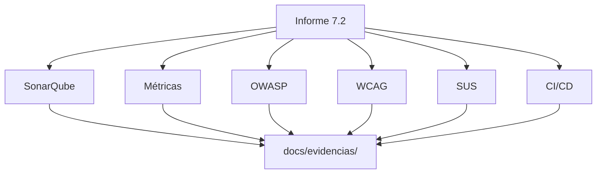

# 📚 Documentación técnica SGOHA

Expediente de calidad, seguridad, accesibilidad y usabilidad — **Punto 7.2**.

## Documento principal

| Documento | Descripción | Enlace |
| --------- | ----------- | ------ |
| 🛡️ Informe integral 7.2 | Análisis Sonar · Métricas · OWASP · WCAG · SUS · CI/CD | [INFORME_TECNICO_INTEGRAL_7_2.md](./INFORME_TECNICO_INTEGRAL_7_2.md) |

## Áreas técnicas

| Área | Documentos clave |
| ---- | ---------------- |
| 🔍 SonarQube | [Guía ejecución](./reportes/sonar/GUIA_EJECUCION_SONARQUBE.md) · [Cobertura](./reportes/sonar/coverage-summary.md) · [ESLint frontend](./reportes/sonar/frontend-quality.txt) |
| 📊 Métricas | [COVERAGE_ANALYSIS.md](./COVERAGE_ANALYSIS.md) |
| 🔐 OWASP | [OWASP_ANALYSIS.md](./reportes/security/OWASP_ANALYSIS.md) · [npm audit](./reportes/security/NPM_AUDIT_INTERPRETATION.md) · [CodeQL](./reportes/security/CODEQL_ANALYSIS.md) · [ZAP](./reportes/security/OWASP_ZAP_GUIDE.md) |
| ♿ WCAG | [WCAG_2_2_VALIDATION.md](./reportes/accessibility/WCAG_2_2_VALIDATION.md) · [Checklist manual](./reportes/accessibility/WCAG_MANUAL_CHECKLIST.md) |
| 🧑‍💻 SUS | [SUS_ANALYSIS.md](./reportes/usability/SUS_ANALYSIS.md) · [Protocolo](./reportes/usability/SUS_EVALUATION_PROTOCOL.md) · [Cuestionario](./plantillas/CUESTIONARIO_SUS.md) |
| ⚙️ CI/CD | [CI_CD_GITHUB_ACTIONS.md](./CI_CD_GITHUB_ACTIONS.md) |
| 🧪 Pruebas | [TEST_PLAN.md](./TEST_PLAN.md) · [TEST_EVIDENCES.md](./TEST_EVIDENCES.md) · [REGISTRO_PRUEBAS.md](./plantillas/REGISTRO_PRUEBAS.md) |
| 📸 Evidencias | [evidencias/README.md](./evidencias/README.md) |

## Plantillas

- [MATRIZ_HALLAZGOS.md](./plantillas/MATRIZ_HALLAZGOS.md)
- [CUESTIONARIO_SUS.md](./plantillas/CUESTIONARIO_SUS.md)
- [sus-responses-template.csv](./reportes/usability/sus-responses-template.csv)

## Comandos rápidos

```bash
npm test                    # 208 pruebas Jest
npm run test:coverage       # LCOV + HTML
npm run test:a11y           # Cypress axe (preview :5173)
npm run audit:security      # npm audit JSON
npm run sus:calculate       # Tras completar CSV de respuestas
```

## Diagrama del expediente


