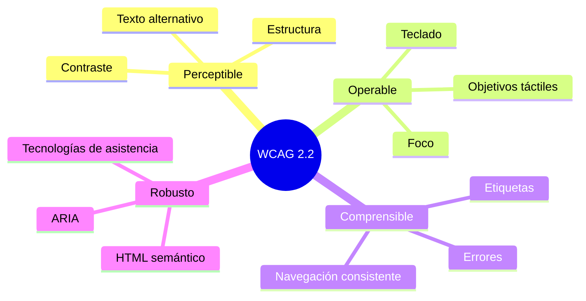

# Validación WCAG 2.2 — SGOHA

> **Nivel objetivo:** AA · **Fecha:** 2026-06-17 · **Estado:** Cumplimiento de criterios **evaluados** con objetivo WCAG 2.2 AA (no certificación total)

## Alcance

Pantallas del PMV: login, dashboard ADMIN, usuarios, cursos, docentes, disponibilidad, aulas, estudiantes, franjas, matrícula (admin y alumno), horarios, restricciones, configuración, portales docente/alumno.

## Metodología

| Fase | Herramienta | Cobertura |
| ---- | ----------- | --------- |
| Automática | Cypress + `cypress-axe` / axe-core | Reglas WCAG 2.x A/AA |
| Automática | Lighthouse CI (`lighthouserc.json`) | Categoría accessibility |
| Manual | Checklist [`WCAG_MANUAL_CHECKLIST.md`](./WCAG_MANUAL_CHECKLIST.md) | Teclado, zoom, lector |

## Herramientas

```bash
cd frontend && npm run build && npm run preview -- --port 5173 &
npm run test:a11y
# Lighthouse (requiere @lhci/cli global o npx):
npx @lhci/cli autorun
```

## Principios WCAG



## Resultados automáticos (axe)

| Pantalla | Spec Cypress | Violaciones críticas | Estado |
| -------- | ------------ | -------------------- | ------ |
| Login | `login.cy.js`, `a11y-login.cy.js` | 0 (umbral configurado) | 🧪 Caso definido |
| Dashboard ADMIN | `admin-dashboard.cy.js` | 0 críticas | 🧪 Caso definido |
| Cursos | `courses.cy.js` | 0 críticas | 🧪 Caso definido |
| Docentes | `teachers.cy.js` | 0 críticas | 🧪 Caso definido |
| Disponibilidad docente | `teacher-availability.cy.js` | 0 críticas | 🧪 Caso definido |
| Matrícula alumno | `student-enrollment.cy.js` | 0 críticas | 🧪 Caso definido |
| Horarios | `schedules.cy.js` | 0 críticas | 🧪 Caso definido |

> Ejecutar `npm run test:a11y` con preview en `:5173` para obtener salida verificable en CI.

## Correcciones implementadas

| ID | Corrección | Archivo |
| -- | ---------- | ------- |
| A11Y-01 | `lang="es"` en documento | `frontend/index.html` |
| A11Y-02 | `aria-invalid`, `aria-describedby` en inputs | `components/ui/Input.jsx` |
| A11Y-03 | Foco y `role="dialog"` en modales | `components/ui/Modal.jsx` |
| A11Y-04 | Alertas de formulario en ClassroomList | `pages/ClassroomList.jsx` |

## Lighthouse

Configuración: [`lighthouserc.json`](../../../lighthouserc.json)

**Resultados:** Requiere ejecución local o CI — salida en `docs/reportes/accessibility/lighthouse/`. No se documentan puntuaciones sin ejecución real.

## Validación manual

Ver [`WCAG_MANUAL_CHECKLIST.md`](./WCAG_MANUAL_CHECKLIST.md) — 🧑‍💻 Validación humana requerida para teclado completo, zoom 200 % y lector de pantalla.

## Nivel alcanzado

**Cumplimiento de criterios evaluados con objetivo WCAG 2.2 AA.** Persisten revisiones manuales y ampliación de specs a todas las pantallas administrativas.

## Conclusión

La automatización axe cubre flujos críticos por rol. Las mejoras en componentes base (`Input`, `Modal`) benefician formularios de matrícula y gestión académica. La certificación AA completa exige completar checklist manual y Lighthouse en entorno de staging.
