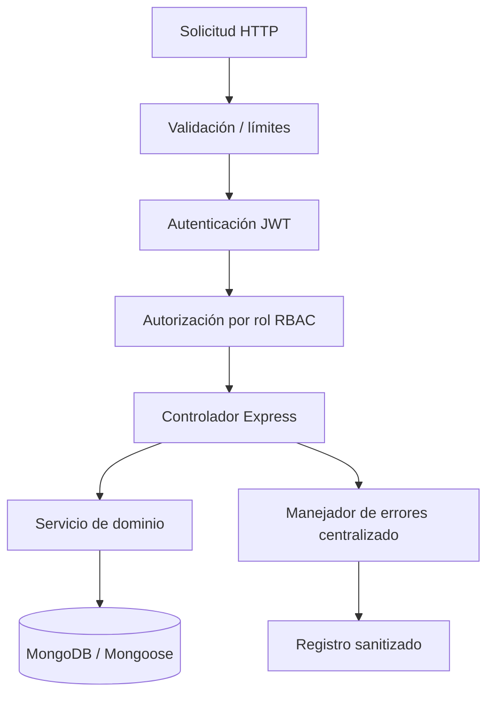

# Análisis OWASP Top 10 — SGOHA

> **Alcance:** `backend/src`, `frontend/src`, CI/CD · **Fecha:** 2026-06-17 · **Metodología:** Revisión de código + npm audit + controles implementados

## Diagrama de defensa en profundidad



## Matriz de riesgos

| ID | Categoría OWASP | Componente | Escenario | Prob. | Impacto | Riesgo | Control actual | Mejora | Estado |
| -- | --------------- | ---------- | --------- | ----- | ------- | ------ | -------------- | ------ | ------ |
| OW-01 | Broken Access Control | API REST | Alumno accede a `PUT /api/users` | Media | Alta | 🟠 | `protect` + `authorizeRoles` por ruta | Tests de integración por rol | 🟢 |
| OW-02 | Security Misconfiguration | Express | CORS abierto en desarrollo | Alta | Media | 🟡 | CORS restrictivo en producción (`CLIENT_URL`) | Documentar despliegue | 🟢 |
| OW-03 | Supply Chain | npm | Dependencia vulnerable | Media | Media | 🟡 | `npm audit`, Dependabot, CI | Actualizar `react-router`, `vite` | 🟡 |
| OW-04 | Cryptographic Failures | Auth | JWT débil o sin expiración | Baja | Alta | 🟡 | `jsonwebtoken` + `JWT_SECRET` en env | Rotación de secretos en prod | 🟢 |
| OW-05 | Injection | Mongoose | NoSQL injection en filtros | Baja | Alta | 🟢 | Esquemas tipados, sin `$where` dinámico | Validar ObjectId en params | 🟢 |
| OW-06 | Insecure Design | Matrícula | Bypass de prerrequisitos | Media | Alta | 🟠 | Validación servidor en `enrollment.service` | ↑ cobertura pruebas matrícula | 🟡 |
| OW-07 | Authentication Failures | Login | Fuerza bruta | Media | Alta | 🟠 | `loginRateLimiter` (20/15 min) | MFA futuro | 🟢 |
| OW-08 | Integrity Failures | CI | Workflow malicioso | Baja | Alta | 🟡 | Permisos mínimos en Actions | Pin de acciones por SHA | 🟡 |
| OW-09 | Logging Failures | Producción | Sin alertas de abuso | Media | Media | 🟡 | `morgan` combined en prod | SIEM / alertas | 🟡 |
| OW-10 | Exception Handling | API | Stack trace al cliente | Baja | Media | 🟢 | `errorHandler` oculta stack en prod | — | 🟢 |

---

## Detalle por categoría

### 1. Broken Access Control 🟢

| Campo | Detalle |
| ----- | ------- |
| **Aplicabilidad** | Alta — tres roles (ADMIN, TEACHER, STUDENT) |
| **Evidencia** | `auth.middleware.js`: `protect`, `authorizeRoles`; rutas admin en `user.routes.js`, `schedule.routes.js` |
| **Escenario** | Docente intenta listar todos los usuarios |
| **Control** | Middleware rechaza con 403 |
| **Estado** | 🟢 Conforme en rutas revisadas |

### 2. Security Misconfiguration 🟢

| Campo | Detalle |
| ----- | ------- |
| **Evidencia** | `helmet`, límite JSON `1mb`, rate limit API (`security.middleware.js`) |
| **Hallazgo** | CSP de Helmet solo en `NODE_ENV=production` |
| **Mejora** | Afinar CSP para assets Vite en despliegue |
| **Estado** | 🟢 Mejoras aplicadas en PMV |

### 3. Software Supply Chain 🟡

| Campo | Detalle |
| ----- | ------- |
| **Evidencia** | [`NPM_AUDIT_INTERPRETATION.md`](./NPM_AUDIT_INTERPRETATION.md) |
| **Backend** | `qs` corregido a 6.15.2 |
| **Frontend** | 5 hallazgos (dev + runtime) — monitoreo activo |
| **Estado** | 🟡 Observación |

### 4. Cryptographic Failures 🟢

| Campo | Detalle |
| ----- | ------- |
| **Evidencia** | `User.js`: bcrypt cost 10; password excluido en queries por defecto |
| **JWT** | Variable `JWT_SECRET` en `.env.example` (plantilla, no secreto real) |
| **Estado** | 🟢 |

### 5. Injection 🟢

| Campo | Detalle |
| ----- | ------- |
| **Evidencia** | Mongoose; sin concatenación SQL; inputs JSON parseados |
| **Frontend** | Sin `dangerouslySetInnerHTML` detectado en `frontend/src` |
| **Estado** | 🟢 |

### 6. Insecure Design 🟡

| Campo | Detalle |
| ----- | ------- |
| **Escenario** | Matrícula con créditos fuera de rango 20–22 |
| **Control** | `enrollment.service.js` valida créditos y prerrequisitos |
| **Riesgo residual** | Cobertura de pruebas ~30 % global |
| **Estado** | 🟡 Reforzar pruebas de dominio |

### 7. Authentication Failures 🟢

| Campo | Detalle |
| ----- | ------- |
| **Evidencia** | `auth.routes.js` + `loginRateLimiter`; usuario inactivo rechazado en servicio |
| **Frontend** | Token en `localStorage`; interceptores Axios 401 → logout |
| **Estado** | 🟢 |

### 8. Software/Data Integrity 🟡

| Campo | Detalle |
| ----- | ------- |
| **CI** | `package-lock.json` versionado; Dependabot semanal |
| **Mejora** | Firmar releases; verificar integridad de acciones |
| **Estado** | 🟡 |

### 9. Logging and Alerting 🟡

| Campo | Detalle |
| ----- | ------- |
| **Evidencia** | Morgan en dev/combined en prod |
| **Gap** | Sin correlación de intentos fallidos de login |
| **Estado** | 🟡 Planificado para producción |

### 10. Mishandling Exceptions 🟢

| Campo | Detalle |
| ----- | ------- |
| **Evidencia** | `error.middleware.js`: respuesta `{ success, message }` uniforme |
| **Estado** | 🟢 |

---

## Pruebas ejecutables

```bash
npm run audit:security   # JSON en docs/reportes/security/
cd backend && npm ls qs
npm test                 # 208 pruebas — regresión post-fix qs
```

## Evidencias

| Código | Ruta |
| ------ | ---- |
| SEC-01 | `docs/reportes/security/backend-npm-audit.json` |
| SEC-02 | `docs/reportes/security/frontend-npm-audit.json` |
| SEC-03 | `docs/reportes/security/NPM_AUDIT_INTERPRETATION.md` |
| SEC-04 | `docs/evidencias/owasp/` (capturas ZAP — requiere ejecución workflow) |
