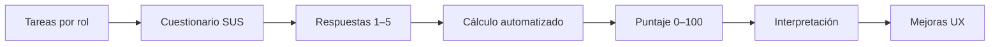

# Análisis SUS — SGOHA

## Concepto

El **System Usability Scale (SUS)** es un cuestionario estandarizado de 10 ítems que produce un puntaje 0–100 de usabilidad percibida. Es ampliamente usado en sistemas académicos y administrativos.

## Objetivo en SGOHA

Evaluar si administradores, docentes y alumnos pueden completar flujos críticos (matrícula, disponibilidad, horarios) con fricción aceptable.

## Metodología

| Elemento | Referencia |
| -------- | ---------- |
| Cuestionario | [`plantillas/CUESTIONARIO_SUS.md`](../../plantillas/CUESTIONARIO_SUS.md) |
| Piloto metodológico | [`SUS_PILOT_METHODOLOGY.md`](./SUS_PILOT_METHODOLOGY.md) |
| Protocolo real | [`SUS_EVALUATION_PROTOCOL.md`](./SUS_EVALUATION_PROTOCOL.md) |
| Datos | [`sus-responses-template.csv`](./sus-responses-template.csv) |

## Fórmula

```text
Impares (1,3,5,7,9):  aporte = respuesta - 1
Pares (2,4,6,8,10):   aporte = 5 - respuesta
SUS = suma_aportes × 2.5
```

## Herramienta de cálculo

```bash
npm run sus:calculate
# o con CSV específico:
node scripts/calculate-sus.js docs/reportes/usability/sus-responses.csv
```

Salidas: `sus-results.json`, `SUS_RESULTS.md`

## Flujo



## Resultados reales

**Instrumento, automatización y protocolo completamente implementados;** la aplicación con participantes constituye una **validación humana posterior**.

No existe aún `sus-responses.csv` con datos de usuarios reales. Cuando exista, ejecutar el script y enlazar `SUS_RESULTS.md` desde el informe 7.2.

## Hallazgos cualitativos (hipótesis de diseño)

| Área | Observación de diseño | Mejora sugerida |
| ---- | --------------------- | --------------- |
| Matrícula alumno | Flujo multi-paso | Indicador de progreso persistente |
| Disponibilidad docente | Grilla densa | Leyenda y atajos de teclado |
| Generación horarios | Terminología CSP | Glosario contextual |

## Conclusión

SGOHA dispone de instrumento SUS localizado, plantilla de datos, script de cálculo reproducible y protocolo por rol. La puntuación agregada del sistema **requiere sesiones con participantes** según el protocolo publicado.
